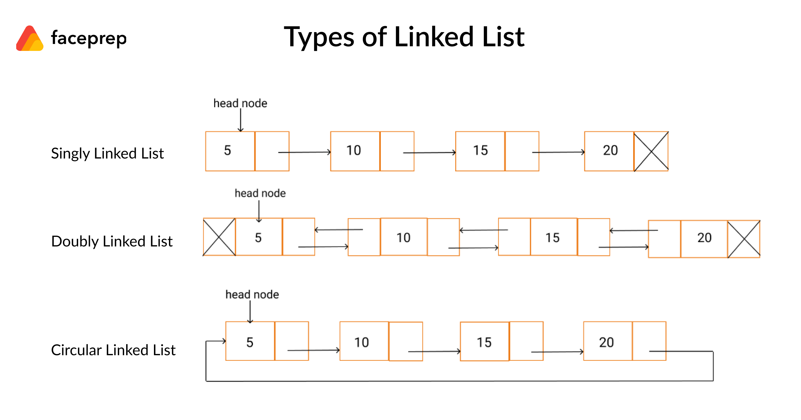
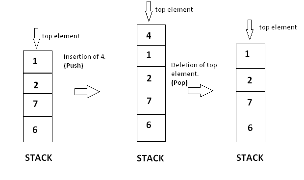
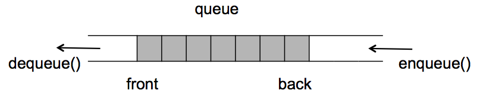

# Data structures

## What is data structure?
Trong computer science, data structure là một format dùng để tổ chức, quản lí và lưu trữ data để truy xuất và điều chỉnh dễ dàng. Cụ thể hơn, data structure là một collection của data values, và các element bên trong data structure có quan hệ với nhau.
## Types of data structures?

Data structure gồm 2 loại chính:
- Linear data structure
- Non-linear data structure

### Linear data structure

1. Array

Array là một tập hợp các phần tử(data item) được lưu vào trong một vùng nhớ liên tục. Một array chỉ bao gồm các data item có cùng kiểu dữ liệu(all integers, all characters). Mỗi một phần tử bên trong array được định danh bởi một unique index.

2. Linked List

- Linked List là một linear data structure mà mỗi phần tử của nó là một object, và các phần tử không được lưu bằng một vùng nhớ liên tục như *array* mà được liên kết với nhau bằng pointers.

- Mỗi node trong *linked list* lưu 2 thông tin - data và next pointer để liên kết với node tiếp theo.

- Có 3 loại linked list: Singly linked list, Doubly linked list, Circular linked list.

Singly linked list(danh sách liên kết đơn): Là một danh sách liên kết một chiều, Độ phức tạp của push là O(1), của pop/access/insert/remove/get/set là O(n) vì phải duyệt toàn bộ danh sách liên kết.

Doubly linked list(danh sách liên kết kép): Là một danh sách liên kết hai chiều. Lợi ích của việc có thể duyệt phần tử từ hai chiều là khi thực hiện pop/access/insert/remove/get/set thì độ phức tạp giảm đi một nữa. Lí do là khi node cần tìm ở gần tail thì chỉ cần duyệt từ tail lên trên mà không cần phải duyệt từ head.

Circular linked list(danh sách liên kết vòng): Là một danh sách liên kết mà bất kì node nào cũng có thể là head node. Có lợi trong việc hiện thực *queue* vì không cần lưu cả *front* và *rear*, mà chỉ cần lưu *front* và *rear* sẽ là *front.next*

3. Stack

Stack là một container of objects nơi mà việc insert hoặc remove được thực hiện dựa trên LIFO(last in first out) principle.

4. Queue

Queue là một container of objects nơi mà việc insert hoặc remove được thực hiện dựa trên FIFO(first in first out) principle.

### Non-linear data structure